[Paper Link](https://arxiv.org/abs/2311.00047) | [Dataset Link](https://github.com/vl-illusion/dataset)

### Intro

**Motivations**

- Humans are susceptible to visual illusions where we perceive things differently than physical reality 
- Do Vision-Language Models (VLMs), an emergent human-computer interface, also show similar phenomena? Or do they faithfully represent reality.

**In this work**

- We built [Grounding Visual Illusion in Language (GVIL) dataset](https://github.com/vl-illusion/dataset), a new dataset that systematically evaluate the problem.
- Among all other exciting findings, we found that although the alignment between model and human's perception is low under illusion, larger models are more susceptible to visual illusions, and closer to human perception.

## The Grounding Visual Illusion in Language (GVIL) Dataset
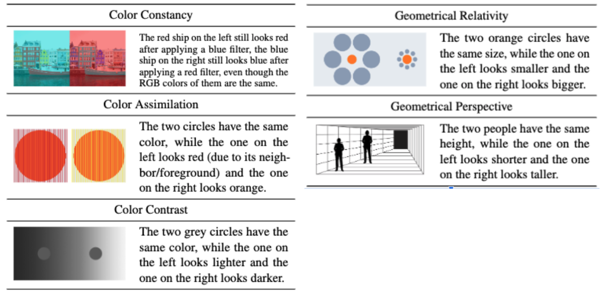

The curated dataset contains over 1600 data points across five types of illusions and supports 4 different evaluation protocols.

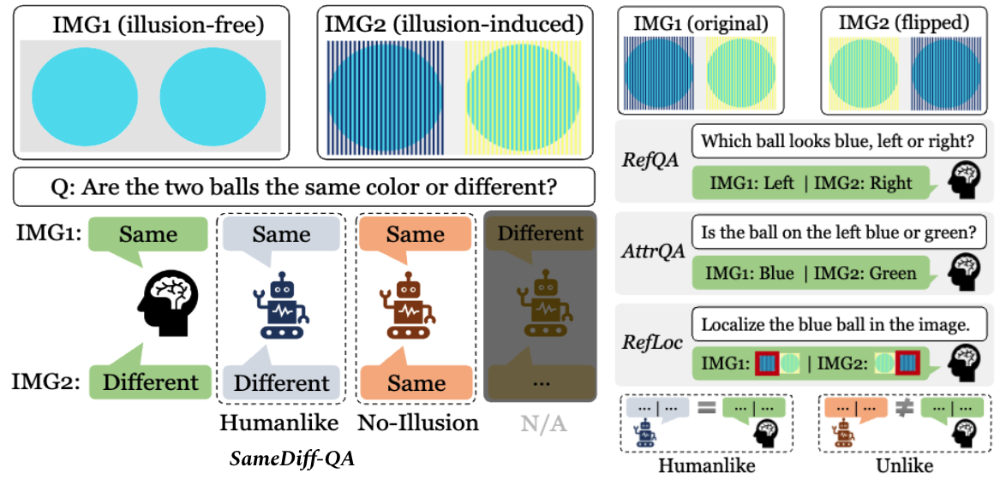

## Experiments and Results
We evaluate four representative models, [LLaVA](https://arxiv.org/abs/2304.08485), [InstructBLIP](https://arxiv.org/abs/2305.06500), [Unified-IO](https://arxiv.org/abs/2206.08916) and [OFA](https://arxiv.org/abs/2202.03052) on the VL-Illusion dataset. Please refer to [our paper](https://arxiv.org/abs/2311.00047) for more details.

### How Well Do Models Recognize Illusions?
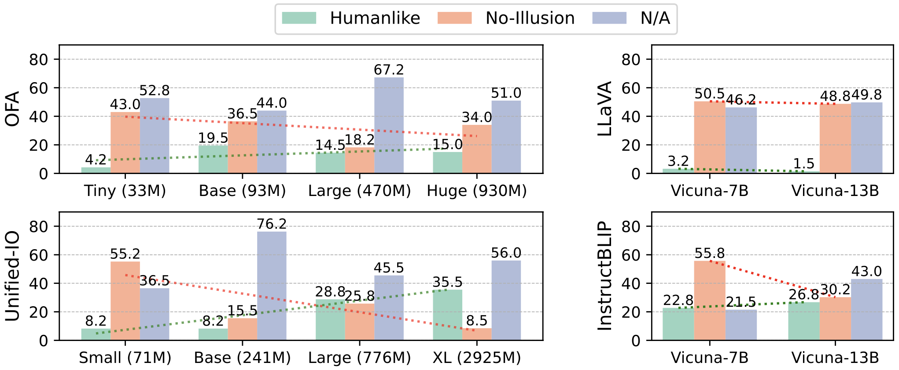

Under SameDiff-QA task, which specially challenges the ability to recognize illusions, we found that models rarely perceive illusions like humans.

But we do confirm that there's a positive correlation between model scale and the ability to recognize illusions

### How Humanlike Are Models Under Illusion?
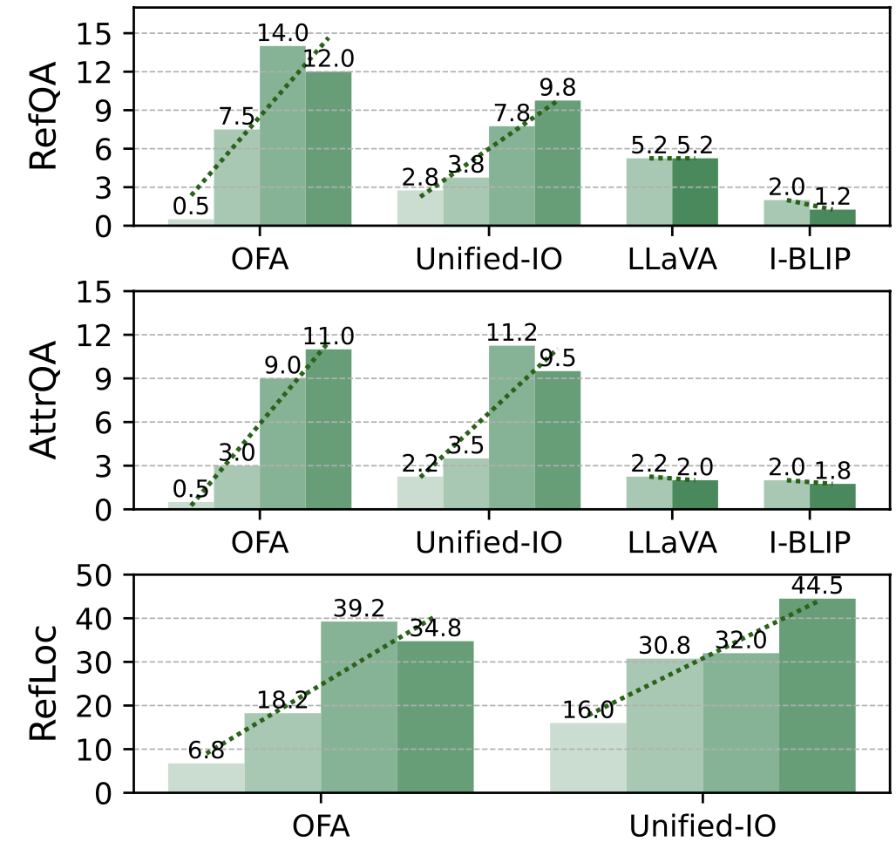

Here, we define humanlike rate as the percentage of data points where the model's prediction is the same as human's prediction.

We find the answer to be complex and model's performance varies significantly across different task formulations. For example, the humanlike rate is quite low on RefQA and AttrQA tasks, but is much higher on RefLoc task.

Again, we confirm that larger models consistently align better with human perception.

### Does Alignment Vary By Illusion Type?
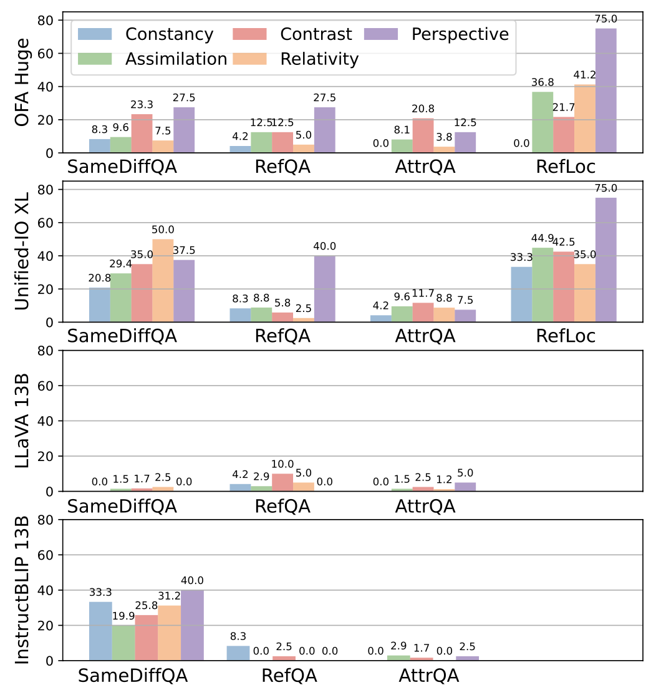

Yes, we found that the humanlike rate varies significantly across different illusion types. Color constancy illusion is the most challenging one for models, while the humanlike rate is much higher for the perspective illusion.

## A Preliminary Study on GPT-4 Vision

As a preliminary study, we also evaluate the recently released GPT-4 Vision model on the GVIL dataset. As of November 4, 2023, our access to the model is limited to the ChatGPT interface, allowing only for qualitative analysis. 

The model often succeeds in simpler tasks like examples 1 and 2 but struggles with hand-crafted ones such as examples 3-6. We hypothesize that this is due to the model being trained on many online illusion resources, but it has limited generalization to complex, unfamiliar scenarios.

### Selected Cases
Notably, we saw that GPT-4

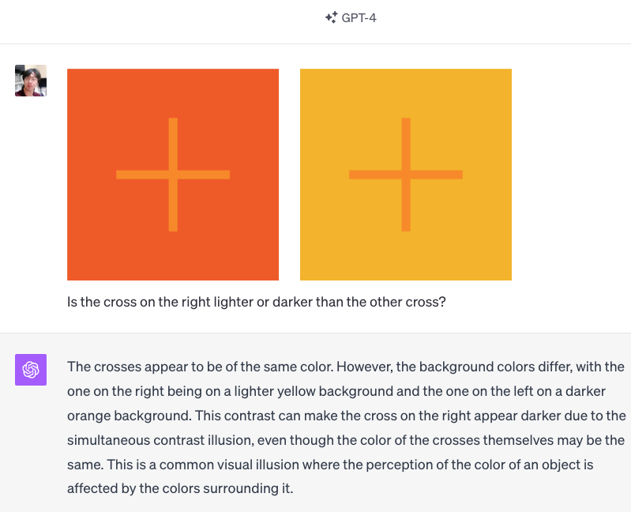
**Example 1**: GPT-4V Got Everything Right. 

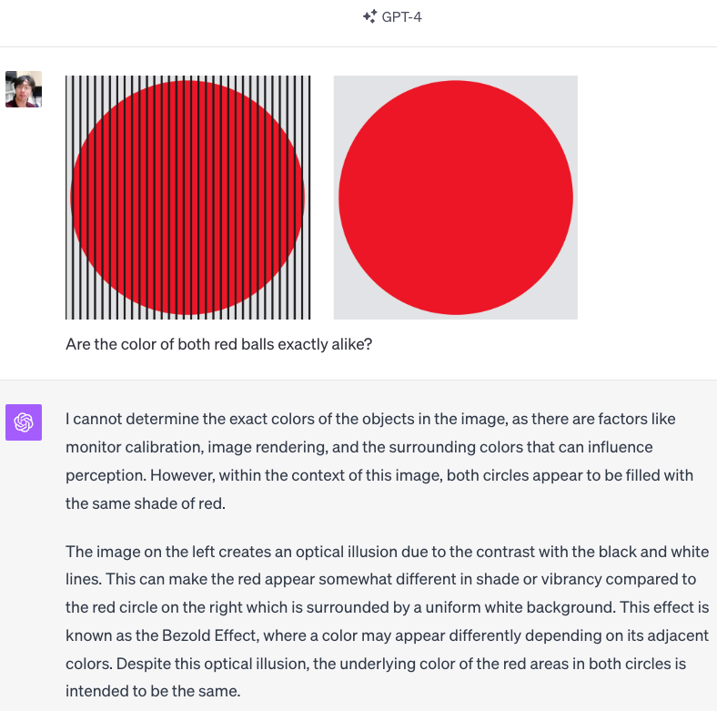
**Example 2**: GPT-4V refuses to give a straight answer, but its explanation is consistent and correct.

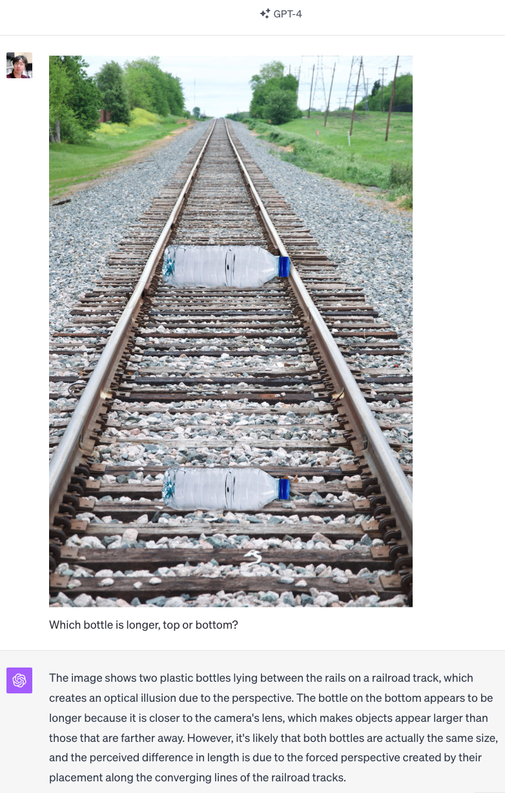
**Example 3**: GPT-4V recognizes the optical illusion, yet mistakenly suggests that the bottom bottle is bigger.

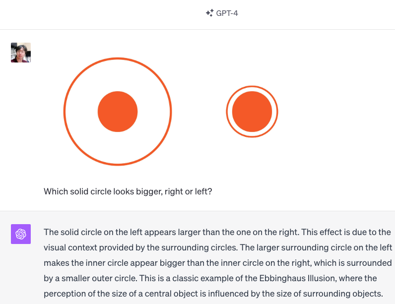
**Example 4**: GPT-4V recognizes the optical illusion, yet mistakenly suggests that the left solid circle is bigger.

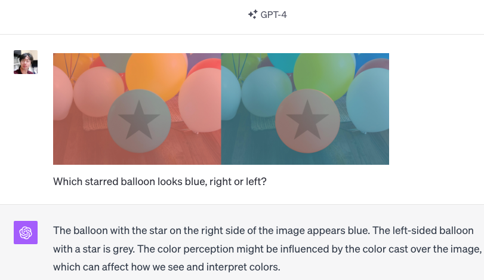
**Example 5**: GPT-4V recognizes the optical illusion, yet mistakenly suggests that the right starred balloon is blue.

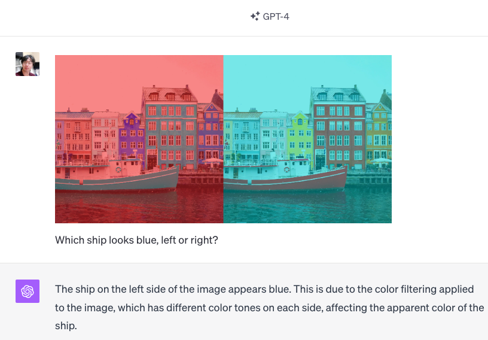
**Example 6**: GPT-4V's prediction is consistent with human's perception.